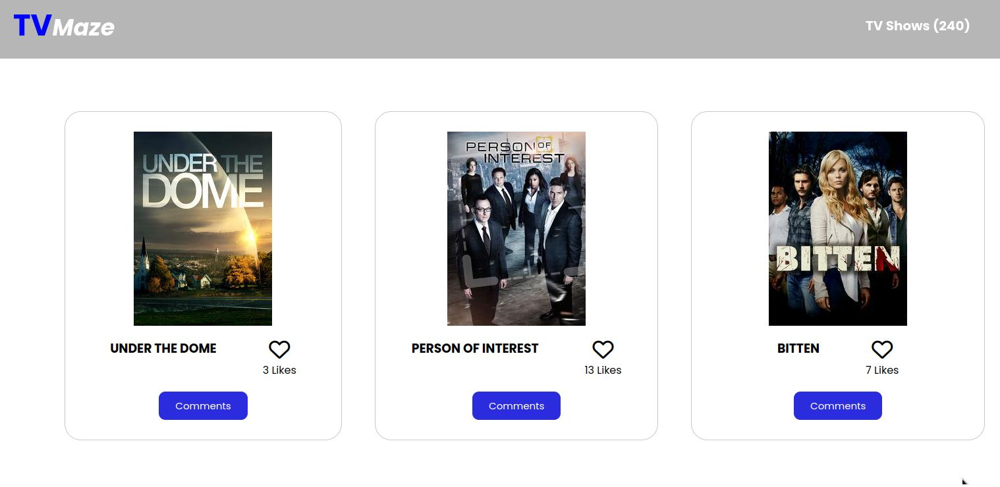
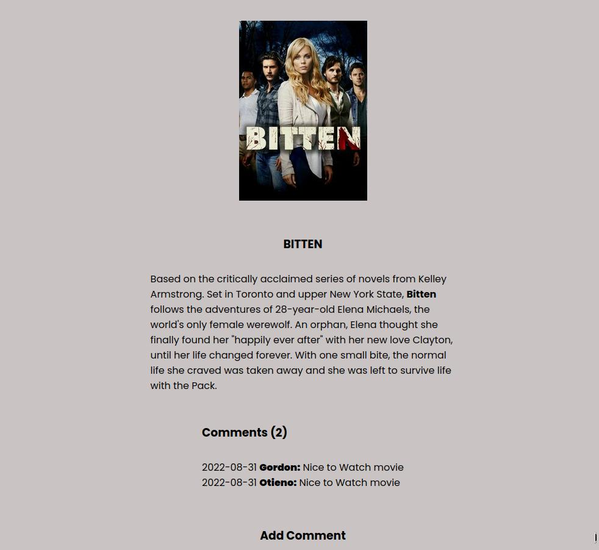

# The TVMaze
TVmaze is a web application that generates random movies from the tv Maze API. More information about the API can be found [here](https://www.tvmaze.com/api)

## Built With

- `HTML` ,`CSS` and `JavaScript`
- Library : `Webpack`
- Technologies used: `GitHub`
- [tv-Maze API](https://www.tvmaze.com/api)                                                                                       
- [involvement API](https://www.notion.so/microverse/Involvement-API-869e60b5ad104603aa6db59e08150270)                                                                                                                         

## Live Demo
Live site URL to Webpack basic setup
[Live Demo Link](https://mystifying-haibt-69e737.netlify.app/)

### Prerequisites

- You only need a browser to run the html file in.

### Setup

- Open your command prompt or terminal and run.
- [Clone the GitHub Repository](https://github.com/samlorlah/first-microverse-webapp.git)
- run this commands in your terminal:
     - `npm install`
     - `npm run build`
     - `npm start`
                                                                                                                                    
### Run tests

- To run tests run : npm run test
- npx hint .
- npx stylelint "**/*.{css,scss}"                                
                                                                                                                               
                                                                                                                                    
### Install

- Open your command prompt or terminal and run.
- https://github.com/samlorlah/first-microverse-webapp.git .

### Deployment

- Project is deployed using github pages

## Authors
👤 **Muyiwa Fawole**

- GitHub: [GitHub](https://github.com/samlorlah)
- Twitter: [Twitter](https://twitter.com/samlorlah)

👤 **Gordon Otieno**

- GitHub: [@Gordon_Otieno ](https://github.com/GordonOtieno)
- Twitter: [@GordonOtieno](https://twitter.com/gordonotieno)
- LinkedIn: [LinkedIn](https://www.linkedin.com/in/gordon-otieno-612b98184/)

## 🤝 Contributing

Contributions, issues, and feature requests are welcome!

Feel free to check the [issues page](https://github.com/samlorlah/first-microverse-webapp/issues).

## Show your support

Give a ⭐️ if you like this project!

## Acknowledgments
Major thanks to 
- [Tv-Maze API](https://www.tvmaze.com/api)                                                                                       
- [Microverse (involvement API)](https://www.notion.so/microverse/Involvement-API-869e60b5ad104603aa6db59e08150270)   

## 📝 License

This project is [MIT](./MIT.md) licensed.
